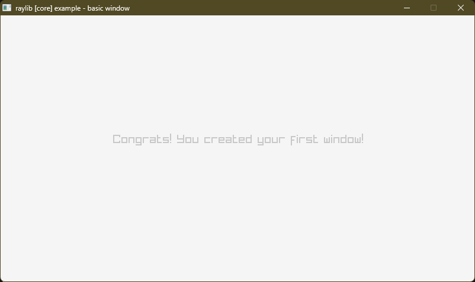
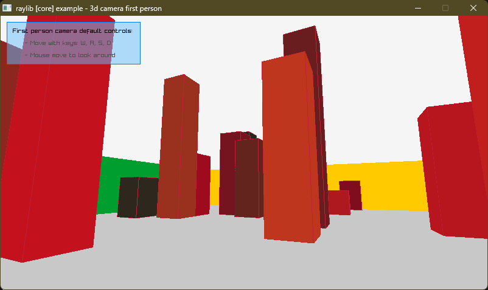
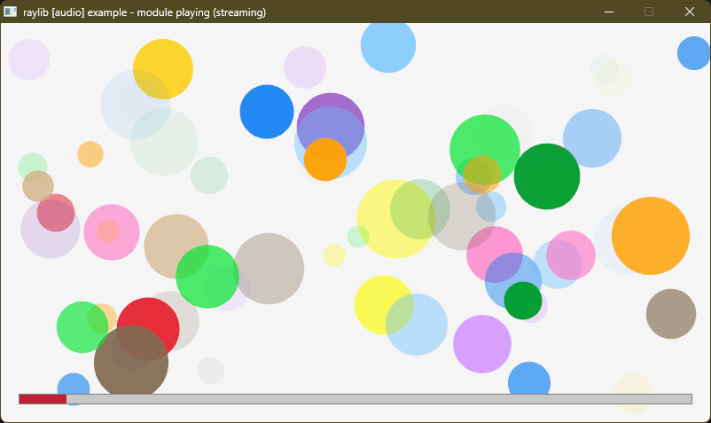

# raylib for QB64-PE


[raylib for QB64-PE](https://github.com/a740g/raylib-64) is a [QB64-PE](https://github.com/QB64-Phoenix-Edition/QB64pe) binding library for [raylib](https://www.raylib.com).
**raylib is a simple and easy-to-use library to enjoy videogames programming.**

raylib is highly inspired by Borland BGI graphics lib and by XNA framework and it's specially well suited for prototyping, tooling, graphical applications, embedded systems and education.





## SUPPORTED PLATFORMS

| API | Windows (x86-64) | Linux (x86-64) | macOS (x86-64) |
| --- | ---------------- | -------------- | -------------- |
| core | :heavy_check_mark: | :heavy_check_mark: | :heavy_check_mark: |
| reasings | :heavy_check_mark: | :heavy_check_mark: | :heavy_check_mark: |
| raymath | :construction: | :construction: | :construction: |
| raygui | :x: | :x: | :x: |
| physac | :x: | :x: | :x: |

## EXAMPLE

```vb
' raylib [core] example - Basic window

'$INCLUDE:'include/raylib.bi'

Const screenWidth = 800
Const screenHeight = 450

InitWindow screenWidth, screenHeight, "raylib [core] example - basic window"

SetTargetFPS 60

Do Until WindowShouldClose
    BeginDrawing

    ClearBackground RAYWHITE

    DrawText "Congrats! You created your first window!", 190, 200, 20, LIGHTGRAY

    EndDrawing
Loop

CloseWindow

System

'$INCLUDE:'include/raylib.bas'
```

More examples are available in the repository.

## FAQ

Why are you loading the shared library using C/C++? Why not use QB64's built-in `DECLARE DYNAMIC LIBRARY`?

- When I initially started out, I wanted to use `DECLARE DYNAMIC LIBRARY` to keep things simple. However, some QB64 language limitations got in the way. For example, you cannot return UTDs from functions and subs and functions cannot take UDT variables by value (yet). raylib does a lot of both. So, I had to make a hard choice of wrapping these functions in C/C++ in a QB64-friendly way. Also, I used a custom autogen program to do the heavy lifting and it made a lot of sense to do the autogen to C/C++.

Where is the source for the autogen program?

- It served it's purpose and helped me kickstart the project and now it has retired. I am not going to share it because I am not proud of the way I wrote it. 😁

I found a bug. How can I help?

- Let me know using GitHub issues or fix it yourself and submit a PR!

Does all of raylib work with QB64?

- Well, mostly. Callbacks are a chanllenge. But it can be done if you are willing to mix a little bit of C with QB64. Stuff requiring usage of pointers can be a little difficult. However, I plan to simplify these by carefully wrapping more raylib functions inside QB64 helper routines.

## NOTES

- This requires the latest version of [QB64-PE](https://github.com/QB64-Phoenix-Edition/QB64pe/releases)
- Some TYPEs and TYPE member variables had to be renamed to resolve clashes with QB64 keywords. E.g. Sound is RSound. Also QB64 does not support TYPE aliases. So, There is no Camera. It's just Camera2D or Camera3D. There is no Texture2D. It's just Texture.
- Lots of functions using strings are not wrapped yet. Use these carefully by null-terminating string before passing them off to raylib functions. If possible, help me wrap these functions. See [include/raylib.bas](include/raylib.bas) for details.

## ASSETS

- The logo for this project was created by pillaging an awesome ANSI art by [grymmjack](https://16colo.rs/artist/grymmjack). I hope he likes it. Or better, makes me a new one. 😁
- Remaining assets were pull directly from the [raylib repository](https://github.com/raysan5/raylib/tree/master/examples). So, the license information there applies.

## HELP NEEDED

- Port all possible raylib examples from [raylib - examples](https://github.com/raysan5/raylib/tree/master/examples)
- Wrap all possible raylib functions that take a string to ensure stings are null-terminated
- See TODO section below

## TODO

- Bindings for raymath
- Bindings for raygui
- Bindings for physac

### Made with ❤️
