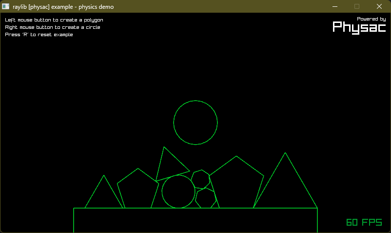

# raylib for QB64-PE

 (v5.0)

[raylib for QB64-PE](https://github.com/a740g/raylib-64) is a [QB64-PE](https://www.qb64phoenix.com/) binding library for [raylib](https://www.raylib.com).
**raylib is a simple and easy-to-use library to enjoy videogames programming.**

raylib is highly inspired by Borland BGI graphics lib and by XNA framework and it's specially well suited for prototyping, tooling, graphical applications, embedded systems and education.





## SUPPORTED PLATFORMS

| API | Windows (x86-64) | Linux (x86-64) | macOS (x86-64) |
| --- | ---------------- | -------------- | -------------- |
| core | :heavy_check_mark: | :heavy_check_mark: | :heavy_check_mark: |
| reasings | :heavy_check_mark: | :heavy_check_mark: | :heavy_check_mark: |
| physac | :heavy_check_mark: | :heavy_check_mark: | :heavy_check_mark: |
| raymath | :heavy_check_mark: | :heavy_check_mark: | :heavy_check_mark: |
| raygui | :x: | :x: | :x: |

## EXAMPLE

```vb
' raylib [core] example - Basic window

'$INCLUDE:'include/raylib.bi'

Const screenWidth = 800
Const screenHeight = 450

InitWindow screenWidth, screenHeight, "raylib [core] example - basic window"

SetTargetFPS 60

Do Until WindowShouldClose
    BeginDrawing

    ClearBackground RAYWHITE

    DrawText "Congrats! You created your first window!", 190, 200, 20, LIGHTGRAY

    EndDrawing
Loop

CloseWindow

System

'$INCLUDE:'include/raylib.bas'
```

More examples are available in the repository.

## FAQ

Why are you loading the shared library using C/C++? Why not use QB64's built-in `DECLARE DYNAMIC LIBRARY`?

- When I initially started out, I wanted to use `DECLARE DYNAMIC LIBRARY` to keep things simple. However, some QB64 language limitations got in the way. For example, you cannot return UTDs from functions and subs and functions cannot take UDT variables by value (yet). raylib does a lot of both. So, I had to make a hard choice of wrapping these functions in C/C++ in a QB64-friendly way. Also, I used a custom autogen program to do the heavy lifting and it made a lot of sense to do the autogen to C/C++.

Why does some raylib TYPEs like Camera, Texture2D, Sound etc. generate an error?

- Some TYPEs and TYPE member variables had to be renamed to resolve clashes with QB64 keywords. E.g. Sound is RSound. Also QB64 does not support TYPE aliases. So, there is no Camera. It's just Camera2D or Camera3D. There is no Texture2D. It's just Texture. As a general rule of the thumb, if a raylib identifier clashes with a QB64-PE keyword an `R` is prefixed to the raylib identifier. Hence, Font become RFont, Sound becomes RSound and so on.

Why have you changed a lot of raylib functions like `LoadTexture`, `GetMousePosition`, `GetMonitorPosition` etc. to QB64 `SUB`s? Should't these be `FUNCTIONS`s?

- Unfortunately, QB64 does not support returning UDTs from `FUNCTION`s (yet) and many raylib functions return UDTs. So, to work around this limitation, I changed many raylib functions to `SUB`s that would otherwise be a `FUNCTION`. The return value is returned to the caller via a SUB parameter. This is usually the last parameter and has the name `retVal`.

What QB64 statements and functions should I avoid while using raylib?

- Any statement or functions that require the QB64 graphics OpenGL window (including all input stuff) should be avoided. Use the raylib alternatives for those.

Does all of raylib work with QB64?

- Well, mostly. Callbacks are a challenge. But, it can be done if you are willing to mix a little bit of C with QB64. Stuff requiring usage of pointers can be a little difficult. I simplified many functions by carefully wrapping them inside QB64 friendly routines. Also, I have included pointer support routines for cases where you have to work with raylib structs (TYPEs) that contain pointers and arrays.

Which version of QB64 should I use with raylib-64?

- Always use the latest version of [QB64-PE](https://www.qb64phoenix.com/) from <https://github.com/QB64-Phoenix-Edition/QB64pe/releases/latest>. QB64-PE has hade a number of bug fixes and improvements that make this library possible. **QB64 v2.0.2 or other forks of QB64 will not work!**

I found a bug. How can I help?

- Let me know using GitHub issues or fix it yourself and submit a PR!

## CREDITS

- [Martin Olivier](https://github.com/martin-olivier) for [Dylib](https://github.com/martin-olivier/dylib) (without this raylib-64 would not be possible; thank you Martin!)
- [Matt Kilgore](https://github.com/mkilgore) for [qb64pe-json](https://github.com/mkilgore/qb64pe-json) (I used this for the autogen program to do most of the heavy lifting; thank you Matt!)
- [Paul Martin](https://github.com/mechatronic3000) for testing raylib-64 and porting many raylib C examples to QB64-PE (thank you mechatronic3000 a.k.a. justsomeguy!)
- [Ramon Santamaria](https://github.com/raysan5) for the awesome [raylib library](https://github.com/raysan5/raylib) (thank you Ray!)
- [Rick Christy](https://github.com/grymmjack) for the raylib-64 [logo](https://16colo.rs/artist/grymmjack) (generously designed and contributed the logo; thank you Rick!)
- Various artists for the example assets taken directly from the [raylib repository](https://github.com/raysan5/raylib/tree/master/examples) (thank you all!)

## HELP NEEDED

- Port all possible raylib examples from [raylib - examples](https://github.com/raysan5/raylib/tree/master/examples)
- Bindings for raymath
- Bindings for raygui

***Made with ❤️ by [a740g](https://github.com/a740g)***
